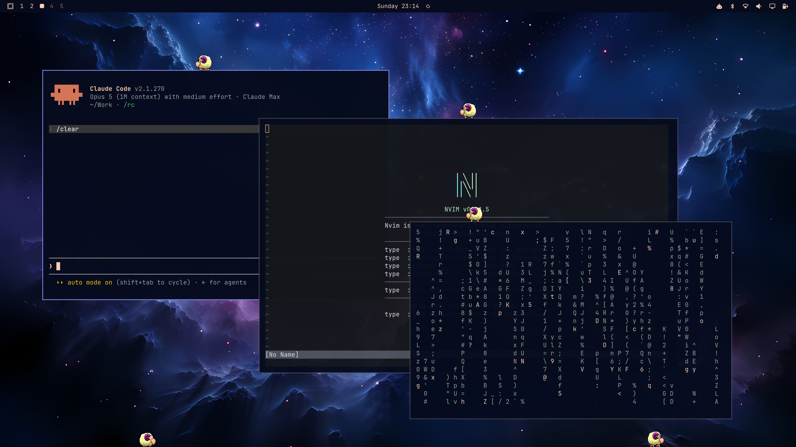

# hyprsheep

A desktop sheep for Hyprland, after the 1995 Windows toy [eSheep][esheep].

The sheep wanders around your screen, walks along the top edges of your
windows, climbs the sides, falls when the window it was standing on closes,
and occasionally stops for a nap. You can pick it up with the mouse, and
throw it.



## Status

Everything works: the overlay, the animation engine, window collision against
live Hyprland geometry, picking the sheep up with the mouse, and multiple
monitors.

## Running

```sh
cargo run --release
```

Nothing needs installing: the sprite sheet and the animation definitions are
baked into the binary.

## Configuration

All optional. Every setting has both a command-line option and a config file
key, and the command line wins:

```sh
hyprsheep --sheep 3 --scale 2 --speed 1.5 --monitors eDP-1,HDMI-A-1
hyprsheep --smooth 0
hyprsheep --pet ~/pets/green_sheep.xml --trace
```

```toml
# ~/.config/hyprsheep/config.toml
sheep     = 1      # how many sheep to keep on screen
scale     = 1      # how big to draw them: 2 is twice the size, 0.5 half
speed     = 1      # how fast they live: 2 is twice the pace, 0.5 half
smooth    = 60     # frames per second to glide between steps; 0 for none
monitors  = "all"  # "all", one name, or ["eDP-1", "HDMI-A-1"]
draggable = true   # whether the sheep can be picked up with the mouse
throw     = true   # whether letting go of a moving sheep throws it
trace     = false  # log every animation change and where the sheep is
climb_windows = false  # whether window sides are solid and climbable
# pet     = "~/pets/green_sheep.xml"
```

`--help` lists the lot. Booleans can be written `--draggable`,
`--no-draggable` or `--draggable=false`, and values as either `--sheep 3` or
`--sheep=3`. `HYPRSHEEP_TRACE=1` is equivalent to `--trace`.

A bad line in the file is reported and its default kept, so a typo cannot
leave you without a sheep; a bad command-line option stops instead, since you
are standing right there to fix it.

`scale` grows or shrinks the sheep, between 0.1 and 20 times its own sprite
size, nearest-neighbour so the pixel art stays sharp. Everything scales with
it - how far the sheep walks per step, how wide a ledge it needs - so a big
sheep behaves like a small one, just larger.

`speed` hurries or slows the whole sheep - walking, climbing and the frames
of every animation alike - by shortening the wait between steps. What the
sheep chooses to do is untouched; it just gets on with it sooner.

`smooth` fills in the gaps between those steps. The pet file moves the sheep
in hops - `walk` is two pixels every tenth of a second - which was fine on a
1995 CRT and reads as a stutter now, so the sprite is drawn part-way along,
arriving just as the next step falls due. Only the position and the fading
are blended: the frames are pixel art and smearing them together would be no
kind of improvement.

Set it to the frame rate you want, up to 240, or to 0 to leave the sheep
hopping as the file describes. It costs nothing while nothing is moving - a
sleeping sheep asks for no frames at all - so the idle cost is the same
either way; a walking one is redrawn up to this many times a second.

With `draggable = false` the overlay is click-through everywhere, with no
region for the pointer to catch on.

A sheep let go of while the mouse is still moving is thrown rather than
dropped: it keeps the speed and the direction the pointer had, arcs under its
own gravity, and lands in whatever the pet file says landing looks like. The
pet format has no animation for an arc - the original only ever dropped the
sheep straight down - so the falling frames are borrowed and the flight is
ours, which is the one part of the sheep's motion that is not data. Catching
it mid-flight ends the throw; so does hitting a wall, a window or the floor.
Only the last tenth of a second of the drag counts, so a drag that comes to
rest before you let go is still a drop. `throw = false` restores the original
behaviour.

With `climb_windows = true` a window is a solid block rather than just a ledge:
the sheep bumps into its left and right faces and can climb them the way it
climbs a screen edge, topping out onto the window's upper edge. Off, which is
the default and what the reference does, only the top edge exists and the sheep
walks straight through the sides.

`pet` loads an alternative pet in the same XML format, sprite sheet and all -
these files are self-contained. The green sheep that ships with web-esheep
works, for instance, and brings 186 animations with it.

## How it works

The behaviour is not hand-written. It comes from the original pet format: a
graph of 54 animations in `assets/animations.xml`, each declaring its frames,
its velocity, and a weighted list of animations it may move to next.

Three separate transition tables decide what happens after every step —
`<sequence>` when an animation runs to completion, `<border>` on hitting a
screen edge or landing on a window, and `<gravity>` when there is nothing
underfoot. Motion is data too: `<start>` and `<end>` carry per-step velocities
that ramp across the sequence, which is why falling accelerates without any
physics code.

Window geometry comes from Hyprland's IPC. `.socket.sock` answers `j/clients`
and `j/monitors`; `.socket2.sock` streams an event per compositor change,
which is used only as a hint to re-read the layout.

The sheep live in one global coordinate space spanning every monitor, so a
sheep can walk off one screen and onto the next. Each output gets its own
`wlr-layer-shell` overlay surface, drawing whichever sheep overlap it; one
straddling the seam is drawn on both. Screen edges are only walls where no
other monitor continues past them, and each monitor keeps its own floor, so a
sheep that walks off a short screen onto a taller one falls.

Each surface is anchored to all four edges, with a negative exclusive zone so
bars cannot displace it. Its input
region is narrowed to just the sheep, so they can be picked up and dragged
while every other click falls straight through to the window underneath.

## Divergences from the reference

Ported from [web-esheep][web], with three deliberate departures, each covered
by a test:

- The `only` attribute on transitions is honoured, so window- and
  taskbar-specific moves require the matching context. The reference ignores
  it entirely, which lets window-only animations play in mid-air.
- Spawn weights are summed correctly. The reference sums the first weight
  repeatedly, which makes its fourth spawn point unreachable.
- `Convert(x, System.Int32)` evaluates as truncation. It is .NET syntax that
  the JavaScript reference throws on, silently reducing two animations to zero
  repeats.

`offsety` and `opacity` are also applied; the reference parses them and then
never uses them. The abduction relies on it: the saucer fades in and the sheep
fades out as it is carried off.

One addition rather than a divergence. The sheet has always carried flying
saucers and aliens that no animation in the eSheep pet file ever used - the
same unused frames sit in Adrianotiger's C# build too. The abduction sequence
is ported from the green sheep, which does use them, and needs no sprites the
original sheet lacks. Only the way into it is ours, hung off taskbar walking
at odds of roughly one abduction every quarter of an hour.

## Licence

GPL-3.0. The sprite sheet and animation data come from web-esheep by Adriano
Petrucci. See `NOTICE`.

[esheep]: https://esheep.petrucci.ch/
[web]: https://github.com/Adrianotiger/web-esheep
